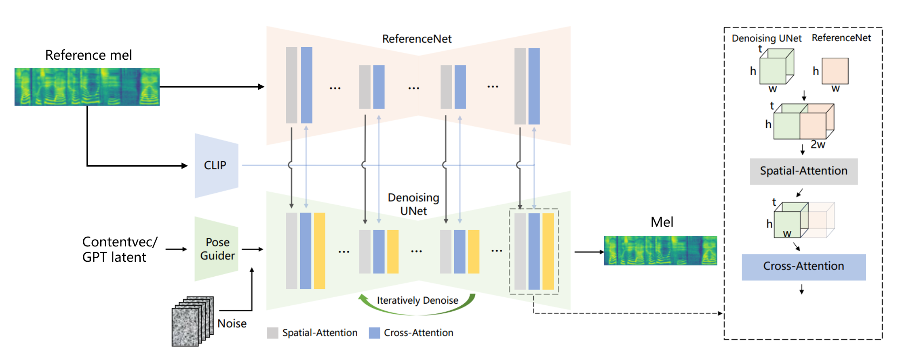

# VC based on Animate anyone

# This branch is working in process.

The structure of v4 is based on animate anyone structure, which is used for controllable video synthsis.
I adopted the unet1d model from the controlnet project.

## train
```
accelerate launch model1.py
```
Thanks to <a href="https://github.com/lllyasviel/ControlNet">controlnet</a> and <a href="https://github.com/HumanAIGC/AnimateAnyone">animate anyone</a> for their great works.
